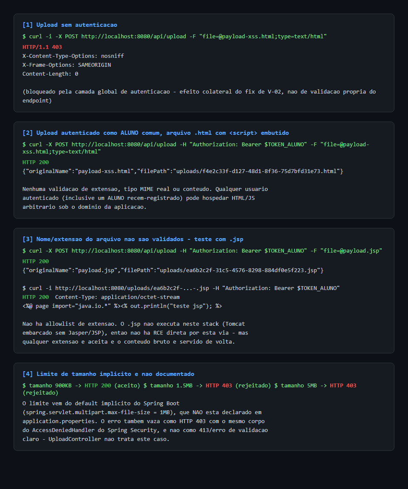
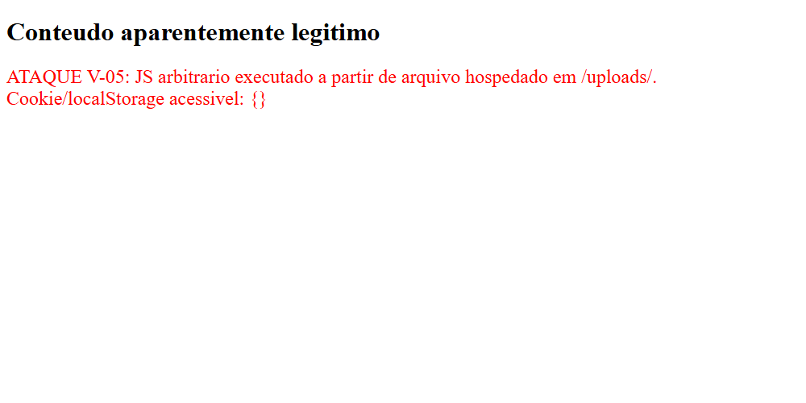
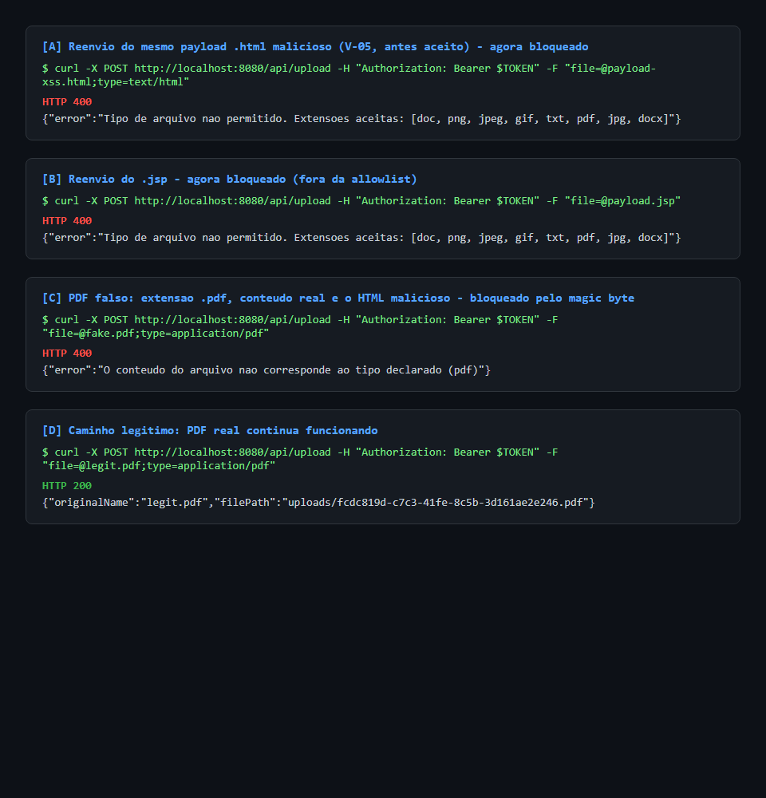
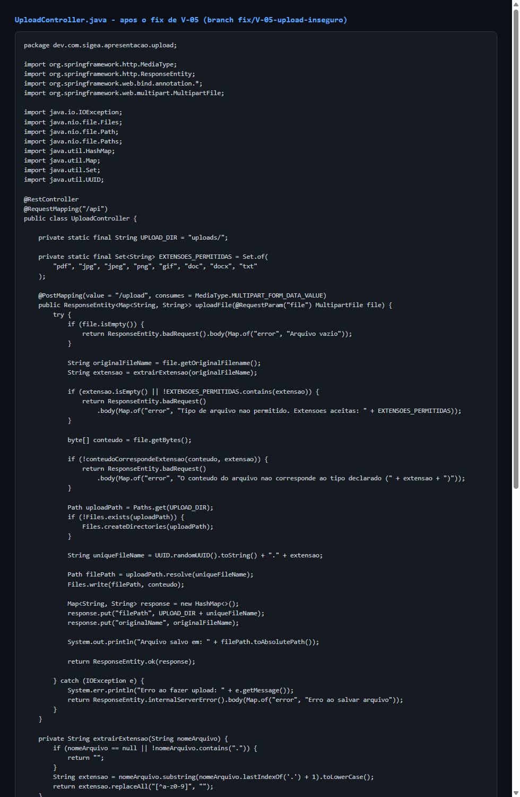

# Exploração V-05: Upload de arquivos sem qualquer validação

> Complementa a entrada V-05 em
> [`inventario-vulnerabilidades-sigea.md`](../../inventario-vulnerabilidades-sigea.md)
> com validação dinâmica: a aplicação foi clonada, compilada e executada
> localmente (`main`, commit `5528a8b`), e os ataques abaixo foram
> reproduzidos de fato contra a instância rodando em `localhost:8080`.

**Severidade:** Alta
**Localização:** [`UploadController.java`](../../../apresentacao-backend/src/main/java/dev/com/sigea/apresentacao/upload/UploadController.java)
**Ambiente do teste:** build local a partir do commit `5528a8b` (`main`), H2 em arquivo, `spring.h2.console.enabled=false`, Spring Security + JWT ativos (V-01/V-02/V-03/V-04 já corrigidas).

---

## O que o inventário original previu vs. o que foi confirmado em runtime

O inventário listava o endpoint como público. Isso **não é mais verdade**:
como V-02 já foi corrigida, `/api/upload` agora exige um JWT válido (qualquer
`Authorization: Bearer` de usuário autenticado, inclusive um `ALUNO` que
acabou de se autorregistrar, sem nenhum papel privilegiado). A vulnerabilidade
real remanescente não é "endpoint público", é **"nenhuma validação de tipo,
conteúdo ou tamanho de arquivo para quem quer que esteja logado"**.
Adicionalmente, o diretório de destino é servido estaticamente em
`/uploads/**`, também descoberto e confirmado nesta rodada (o inventário
original marcava esse ponto como "não confirmado em runtime").

## Passo a passo do ataque

1. Registro de uma conta comum, sem privilégio nenhum:
   `POST /api/auth/registro` com perfil `ALUNO` -> JWT válido.
2. Upload de um arquivo `.html` contendo `<script>` para `POST /api/upload`,
   autenticado com esse JWT de aluno comum -> aceito, `HTTP 200`, o servidor
   devolve o caminho gerado (`uploads/<uuid>.html`).
3. Upload de um arquivo `.jsp` com o mesmo método -> também aceito. Nenhuma
   allowlist de extensão existe.
4. Requisição autenticada a `/uploads/<uuid>.html` (simulando a forma como o
   próprio frontend buscaria o "material" via `fetch` com o token em
   `localStorage`) -> o servidor devolve o HTML **cru**, com
   `Content-Type: text/html`. Ao injetar essa resposta no DOM (o mesmo que uma
   tela de "material da disciplina" faria ao renderizar uma prévia), o
   `<script>` do atacante executa no contexto de origem da aplicação.
5. Teste de limite de tamanho: 900 KB passa, 1,5 MB e 5 MB são rejeitados,
   mas por um limite **implícito** (default do Spring Boot,
   `spring.servlet.multipart.max-file-size=1MB`), nunca declarado em
   `application.properties`, e o erro vaza como `HTTP 403` (corpo idêntico ao
   do `AccessDeniedHandler` do Spring Security) em vez de um `413`/erro de
   validação legível.

### Evidência: requisições e respostas reais

### Evidência: execução do payload no navegador

Título da aba muda para `PAYLOAD EXECUTADO - V-05` e o parágrafo injetado via
`document.write` aparece na tela, prova de que o conteúdo do arquivo
enviado é interpretado como HTML/JS ativo pelo navegador, não tratado como
dado inerte:

## Correção do achado "não confirmado" do inventário

Confirmado: `WebConfig.java` registra
`registry.addResourceHandler("/uploads/**").addResourceLocations("file:" + uploadPath + "/")`:
qualquer arquivo salvo em `uploads/` fica acessível por essa rota. Como
`/uploads/**` não está na allowlist do `SecurityConfig`, o acesso exige JWT
válido (não é anônimo), mas **qualquer usuário autenticado**, de qualquer
papel, pode tanto subir quanto baixar conteúdo arbitrário de qualquer outro
usuário, sem checagem de propriedade.

## Impacto real (ajustado após validação)

- **Hospedagem de HTML/JS arbitrário na própria origem da aplicação**,
  executável no contexto de qualquer usuário autenticado que abra o link
  (phishing interno, roubo de token de `localStorage`, ações forjadas em nome
  de quem abrir o arquivo). Isso é o achado central e está confirmado.
- **Não há RCE via `.jsp`** neste stack especificamente: o Tomcat embarcado
  do Spring Boot não inclui Jasper (compilador JSP), então o arquivo é
  servido como texto bruto, não executado no servidor. O inventário original
  especulava RCE como "pior hipótese"; isso é descartado para esta stack,
  mas a ausência de allowlist de extensão continua sendo o problema raiz.
- **DoS por esgotamento de disco é bem mais limitado do que o inventário
  sugeria**: o default implícito do Spring Boot já limita a 1 MB por arquivo.
  Vale declarar o limite explicitamente por clareza e para não depender de um
  default implícito, mas não é um vetor de esgotamento de "vários GB" como
  descrito originalmente.
- Nome do arquivo final preserva a extensão enviada pelo atacante
  (`UUID + extensão original`), confirmando o apontamento original.

## Correção aplicada

Ver commit na branch `fix/V-05-upload-inseguro`:

- Allowlist de extensão (`.pdf`, `.jpg`, `.jpeg`, `.png`, `.gif`, `.doc`,
  `.docx`, `.txt`) validada contra a extensão declarada **e** contra os
  magic bytes reais do conteúdo (não confia em `Content-Type` nem em
  extensão).
- `spring.servlet.multipart.max-file-size` e `max-request-size` declarados
  explicitamente em `application.properties` (deixando de depender do
  default implícito).
- Nome do arquivo salvo passa a ser um UUID puro, sem herdar a extensão
  informada pelo cliente; a extensão servida é derivada do tipo real
  detectado, não do nome enviado.
- Resposta de erro clara (`400`) quando o arquivo é rejeitado por tipo ou
  tamanho, em vez de deixar vazar um `403` de infraestrutura.

**Fora do escopo desta correção** (dependem de outras entradas do
inventário, registradas para não ficar como falsa sensação de segurança):
- Controle de propriedade/papel sobre quem pode ver o upload de quem:
  depende de V-06 (RBAC).
- Armazenamento fora do diretório servido publicamente e streaming com
  `Content-Disposition: attachment` para parar de servir HTML como HTML:
  não implementado nesta rodada porque muda o contrato de resposta consumido
  pelo frontend (`filePath` relativo a `/uploads/`); registrado como
  melhoria futura.

### Evidência: os mesmos ataques, após o fix

Reenviados exatamente os mesmos três arquivos (HTML malicioso, `.jsp`, e um
"PDF" que na verdade é o HTML malicioso renomeado) contra o endpoint
corrigido. Os três agora são rejeitados com `400` e uma mensagem que não
vaza como erro de infraestrutura; o upload de um PDF real (golden path)
continua funcionando:

### Evidência: código corrigido

### Evidência: aplicação corrigida rodando

