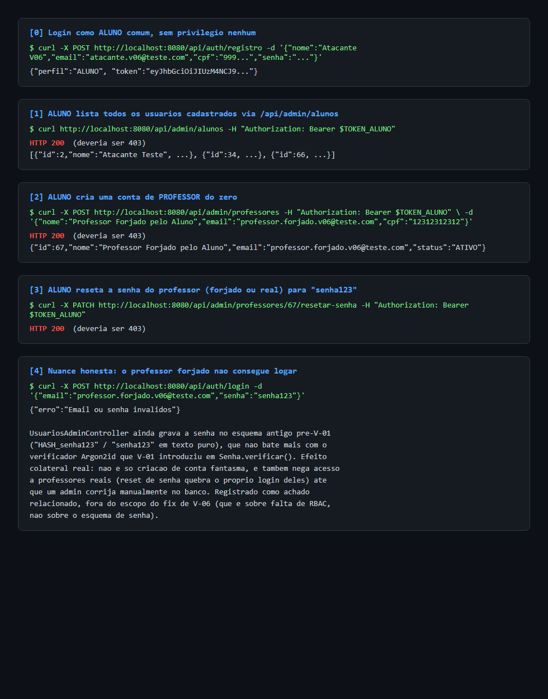
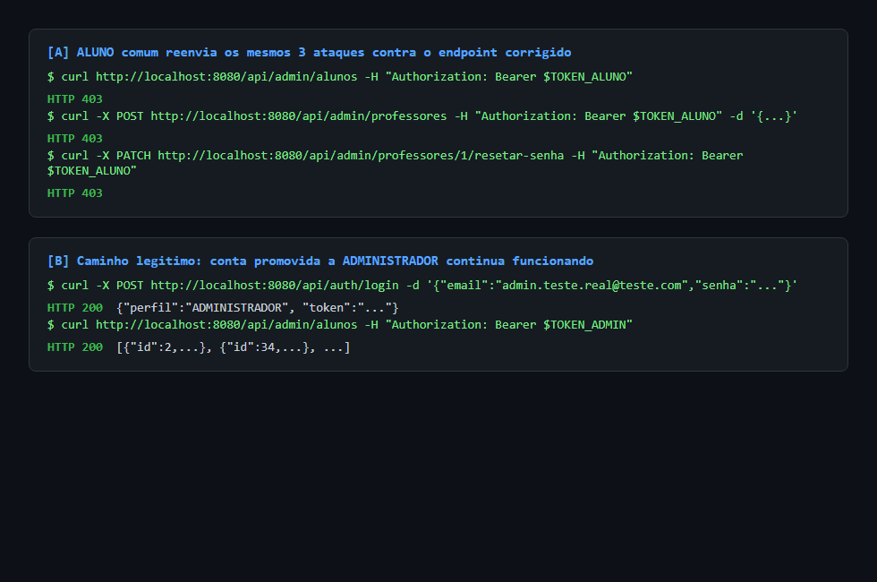
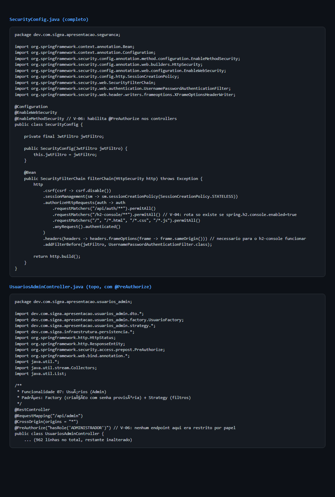
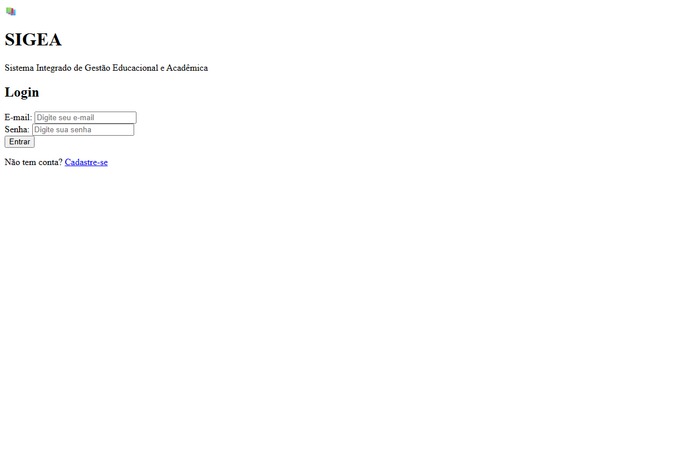

# Exploração V-06: ausência de controle de acesso baseado em papel

> Complementa a entrada V-06 em
> [`inventario-vulnerabilidades-sigea.md`](../../inventario-vulnerabilidades-sigea.md).
> Achado inicial identificado por um colega de equipe (fora deste
> repositório) enquanto investigava V-09; validado dinamicamente aqui: a
> aplicação foi clonada, compilada e executada localmente, e os ataques
> abaixo foram reproduzidos de fato contra a instância rodando em
> `localhost:8080`.

**Severidade:** Alta
**Localização:** [`UsuariosAdminController.java`](../../../apresentacao-backend/src/main/java/dev/com/sigea/apresentacao/usuarios_admin/UsuariosAdminController.java)
**Ambiente do teste:** build local a partir do commit `5528a8b` (`main`), H2 em arquivo, Spring Security + JWT ativos (V-01/V-02/V-03/V-04 já corrigidas).

---

## O problema

Nenhum dos 22 endpoints de `UsuariosAdminController` (mapeados em `/api/admin/**`)
confere o papel de quem está autenticado. Depois que V-02 adicionou
autenticação real, qualquer usuário logado, inclusive um `ALUNO` recém
registrado, passou a poder chamar esses endpoints normalmente: listar e
editar alunos e professores, criar contas de professor, resetar senha de
professor, criar/editar/desativar disciplinas e salas.

## Passo a passo do ataque

1. Registro de uma conta `ALUNO` comum via `POST /api/auth/registro`.
2. Com o token dessa conta, sem nenhum privilégio: `GET /api/admin/alunos`
   devolve a lista completa de alunos cadastrados (`HTTP 200`, deveria ser
   `403`).
3. `POST /api/admin/professores` com esse mesmo token cria uma conta de
   professor do zero (`HTTP 200`, deveria ser `403`).
4. `PATCH /api/admin/professores/{id}/resetar-senha` reseta a senha de
   qualquer professor (`HTTP 200`, deveria ser `403`).

### Evidência: os três ataques antes do fix

## Achado relacionado (fora do escopo deste fix): senha do professor forjado não funciona

Ao tentar logar como o professor recém-criado com a senha padrão
`senha123`, o login falha (`"Email ou senha inválidos"`). Investigando: V-01
trocou a verificação de senha para Argon2id (`Senha.verificar()`), mas
`criarProfessor()` e `resetarSenhaProfessor()` em `UsuariosAdminController`
ainda gravam a senha no esquema antigo pré-V-01 (`"HASH_senha123"` /
`"senha123"` em texto puro), que não bate mais com o verificador atual.

Isso não reduz a gravidade de V-06: a criação de contas e o reset de senha
seguem acontecendo sem nenhuma checagem de papel, o que já é a falha real.
Mas muda o quadro de impacto: o efeito imediato de hoje não é login do
atacante como professor, e sim negação de acesso a um professor real (reset
de senha quebra o próprio login dele) e poluição da base com contas de
professor fantasma. Registrado aqui como achado relacionado; a correção do
esquema de senha nesses dois métodos fica fora do escopo deste PR (é uma
lacuna do fix de V-01, não de V-06).

## Correção aplicada

Ver commit na branch `fix/V-06-rbac`:

- `SecurityConfig` passa a ter `@EnableMethodSecurity`, habilitando
  `@PreAuthorize` nos controllers.
- `UsuariosAdminController` ganha `@PreAuthorize("hasRole('ADMINISTRADOR')")`
  em nível de classe: todos os 22 endpoints agora exigem o papel
  `ADMINISTRADOR`, sem exceção.

O padrão reaproveitado veio de `PerfilAlunoController.semPermissaoSobre()`
(mitigação de V-03, já em `main`), que lê o papel autenticado via
`SecurityContextHolder`. Como aqui não existe um caso de "dono do recurso"
(nenhum endpoint deste controller faz sentido para um não administrador),
`@PreAuthorize` em nível de classe é mais direto que reimplementar a
checagem método a método.

**Fora do escopo deste fix** (mesma causa raiz, controllers diferentes,
registrados para não ficar como falsa sensação de segurança de que "V-06
está 100% corrigida"):
- `DisciplinasPeriodosController` (criação/ativação de período letivo): tem
  o mesmo problema, mas não foi tocado aqui porque ainda não foi confirmado
  se algum endpoint dele deveria ser acessível a `PROFESSOR` além de
  `ADMINISTRADOR`.
- `NotasController` (`/api/sala/{salaId}` de lançamento de notas): também
  sem checagem de papel, mas esse é claramente um endpoint de `PROFESSOR`
  (quem lança nota é o professor da turma, não um admin), então precisa de
  uma checagem de propriedade (professor dono da sala) no estilo de V-03,
  não de um `@PreAuthorize` de classe único como o usado aqui.

### Evidência: os mesmos ataques após o fix, e o caminho legítimo intacto

Reenviados os três ataques com o mesmo tipo de conta (`ALUNO` comum) contra
o endpoint corrigido: os três agora retornam `403`. Para confirmar que o
fix não quebrou o uso legítimo, uma conta foi promovida a `ADMINISTRADOR`
diretamente no banco (via H2 console, habilitado só localmente para este
teste, nunca no código commitado) e usada para chamar o mesmo endpoint:
`200`, resposta normal.

### Evidência: código corrigido

### Evidência: aplicação corrigida rodando

