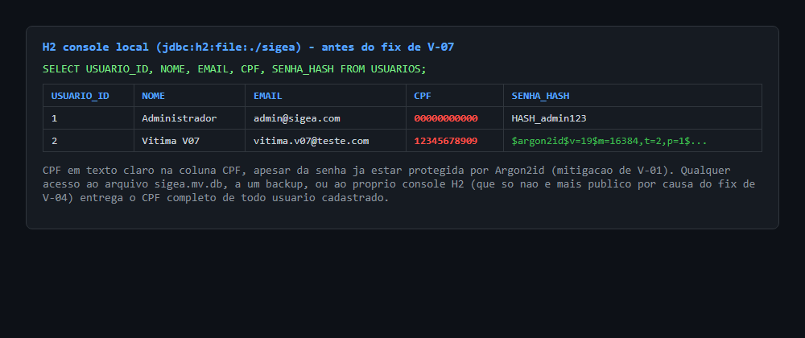
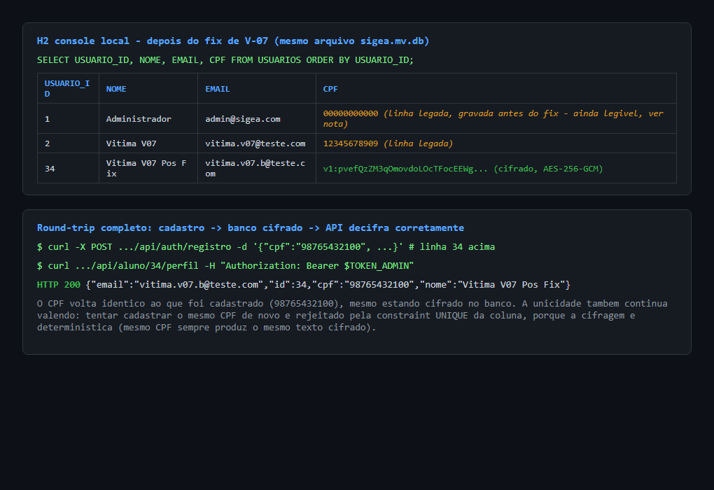
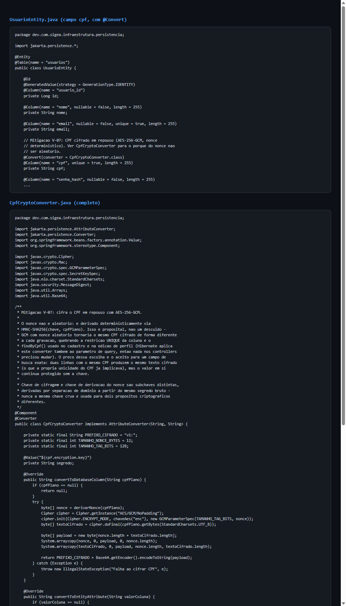

# Exploração V-07: dados pessoais sem proteção criptográfica em repouso

> Complementa a entrada V-07 em
> [`inventario-vulnerabilidades-sigea.md`](../../inventario-vulnerabilidades-sigea.md).
> A aplicação foi clonada, compilada e executada localmente, e a leitura
> abaixo foi feita de fato contra a instância rodando em `localhost:8080`.

**Severidade:** Alta
**Localização:** [`UsuarioEntity.java`](../../../infraestrutura/src/main/java/dev/com/sigea/infraestrutura/persistencia/UsuarioEntity.java), [`V1__criar_schema_completo.sql`](../../../infraestrutura/src/main/resources/db/migration/V1__criar_schema_completo.sql)
**Ambiente do teste:** build local a partir do commit `5528a8b` (`main`), H2 em arquivo, Spring Security + JWT ativos (V-01/V-02/V-03/V-04 já corrigidas).

---

## O problema

CPF (e e-mail) ficam gravados em texto claro na coluna `cpf` da tabela
`Usuarios`. O H2 é um arquivo local (`sigea.mv.db`) sem cifragem própria.
Qualquer acesso ao arquivo, a um backup dele, ou ao console H2 (que só não
é mais público por causa do fix de V-04) entrega o CPF completo de todo
mundo cadastrado.

## Evidência: CPF em texto claro antes do fix

Consulta direta via H2 console local (`jdbc:h2:file:./sigea`, habilitado só
para este teste, nunca no código commitado):

Note que a senha já está protegida (mitigação de V-01, com hash Argon2id
visível na coluna `senha_hash`), mas o CPF ao lado continua legível. É
exatamente o contraste que a entrada do inventário aponta.

## Correção aplicada

Ver commit na branch `fix/V-07-cifragem-cpf`:

- Novo `CpfCryptoConverter` (`AttributeConverter<String, String>`), aplicado
  ao campo `cpf` de `UsuarioEntity` via `@Convert`. Cifra com AES-256-GCM.
- **O nonce não é aleatório: é derivado deterministicamente** via
  HMAC-SHA256(chave, cpfPlano). Isso é proposital. GCM com nonce aleatório
  faria o mesmo CPF virar um texto cifrado diferente a cada gravação, o que
  quebraria a constraint `UNIQUE` da coluna e o `findByCpf()` usado no
  cadastro e na edição de perfil. Como o Hibernate aplica o mesmo conversor
  ao parâmetro de uma query derivada do Spring Data (não só ao valor salvo),
  a cifragem determinística faz `findByCpf(cpfLimpo)` continuar funcionando
  sem que nenhum controller precisasse mudar uma linha.
- Chave de cifragem e chave de derivação do nonce são subchaves distintas,
  derivadas por separação de domínio a partir do mesmo segredo bruto
  (`CPF_ENCRYPTION_KEY`, seguindo o mesmo padrão de variável de ambiente já
  usado por `jwt.secret`). Nunca a mesma chave crua para dois propósitos
  criptográficos diferentes.
- Migration `V25` amplia a coluna `cpf` de `VARCHAR(14)` para
  `VARCHAR(255)` (o texto cifrado em Base64 é bem maior que um CPF em
  claro).

### Sobre linhas já existentes (achado do próprio processo de correção)

Ativar o `@Convert` sem mais nada faria o `CpfCryptoConverter` tentar
decifrar as linhas antigas (que estão em texto claro) e falhar. A correção
usa **fallback tolerante**: se o valor da coluna não começa com o prefixo
`v1:` (marcador de "isto é texto cifrado"), ele é tratado como CPF legado
em texto claro e devolvido como está, sem tentar decifrar. Não há migração
em lote nesta correção; uma linha legada só passa a ser cifrada na próxima
vez que for salva. Ambas as situações aparecem lado a lado na evidência
abaixo (linhas 1 e 2, gravadas antes do fix, seguem legíveis; a linha 34,
criada depois do fix, já está cifrada).

## Evidência: CPF cifrado depois do fix, e round-trip completo

Um novo cadastro com CPF `98765432100` ficou gravado como
`v1:pvefQzZM3qOmovdoLOcTFocEEWg...` no banco. Consultando o perfil desse
aluno pela API (autenticado como administrador, para não esbarrar num bug
não relacionado descrito abaixo), o CPF volta `98765432100`, idêntico ao
original.

Testado também que a unicidade continua valendo: tentar cadastrar o mesmo
CPF de novo é rejeitado (a cifragem determinística garante que o mesmo CPF
sempre produz o mesmo texto cifrado, então a constraint `UNIQUE` do banco
ainda pega duplicata). A rejeição aparece como `HTTP 403` com corpo vazio,
o mesmo padrão de resposta já visto em V-05 quando uma exceção não tratada
(neste caso, violação de constraint do banco) atravessa a cadeia de filtros
do Spring Security antes de chegar num handler específico. Não é uma
regressão introduzida por este fix, é um comportamento pré-existente da
aplicação diante de exceção não tratada.

### Evidência: código corrigido

### Evidência: aplicação corrigida rodando

## Achado relacionado, fora de escopo, encontrado ao testar o round-trip

Durante o teste, `POST /api/auth/registro` devolveu um `usuarioId` em
formato UUID, mas o `usuario_id` real no banco é um `BIGINT` autoincremento
(ex.: `34`). Chamar `/api/aluno/{alunoId}/perfil` com o UUID do registro
não funciona; só funciona com o id numérico real, que só é conhecido depois
de um login subsequente (que busca o usuário de novo no banco e resolve o
id certo). Isso é um bug de inconsistência entre o id de domínio
(`UsuarioId`, gerado como UUID em `UsuarioRepositoryImpl.proximoId()`) e o
id de persistência (`UsuarioEntity.id`, autoincremento), não relacionado a
V-07. Não corrigido aqui; registrado para não se perder.

## Fora de escopo desta correção

- **Mascaramento do CPF nas respostas da API** (ex.: `123.***.***-45`):
  sugerido no inventário original, mas é uma mudança de superfície de API
  em pelo menos `PerfilAlunoController` e `PerfilProfessorController`,
  separada da proteção em repouso que é o núcleo de V-07. Registrado como
  melhoria futura.
- **E-mail continua em texto claro.** O inventário original já observa que
  isso pode ser aceitável se justificado por necessidade de busca; mantido
  assim aqui, sem mudança.
- **Migração em lote das linhas legadas** (ver seção acima): não
  implementada nesta correção.
